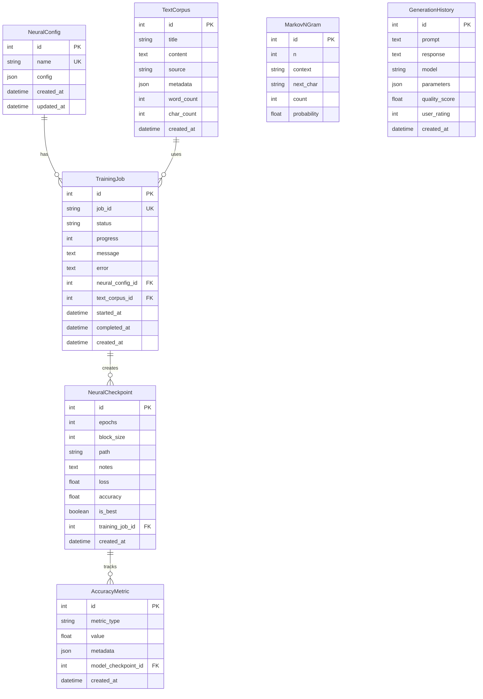

# Database Architecture Documentation

## Overview
The James LLM project uses an enhanced database architecture built on SQLAlchemy ORM with support for connection pooling, migrations, and multiple database backends.

## Architecture Components

### 1. Database Engine (`backend/db/engine.py`)
Enhanced database connection management with:
- **Connection Pooling**: Configurable pool sizes and overflow handling
- **Multi-Database Support**: SQLite (default), PostgreSQL, MySQL
- **Session Management**: Scoped sessions with automatic transaction handling
- **Performance Optimizations**: 
  - SQLite: WAL mode, foreign keys, optimized cache
  - PostgreSQL/MySQL: Connection pool recycling, pre-ping checks

#### Configuration (Environment Variables)
```bash
DB_TYPE=sqlite|postgresql|mysql    # Database type
DATABASE_PATH=james_llm.db        # SQLite path
DB_HOST=localhost                  # PostgreSQL/MySQL host
DB_PORT=5432|3306                 # Database port
DB_USER=james_llm                 # Database user
DB_PASSWORD=password              # Database password
DB_NAME=james_llm                 # Database name
DB_POOL_SIZE=10                   # Connection pool size
DB_MAX_OVERFLOW=20                # Maximum pool overflow
DB_POOL_TIMEOUT=30                # Pool timeout in seconds
DB_POOL_RECYCLE=3600              # Connection recycle time
DB_ECHO=false                     # SQL echo for debugging
DB_USE_POOL=true                  # Enable connection pooling
```

### 2. ORM Models (`backend/db/models.py`)
SQLAlchemy declarative models for all database tables:

#### Core Models
- **NeuralConfig**: Neural network configurations (JSON)
- **TrainingJob**: Training job tracking with status and progress
- **TextCorpus**: Training text data with metadata
- **MarkovNGram**: N-gram models for Markov chains
- **NeuralCheckpoint**: Model checkpoints with performance metrics
- **GenerationHistory**: Text generation history and ratings
- **AccuracyMetric**: Model accuracy tracking
- **DatabaseVersion**: Schema version tracking

#### Model Features
- Automatic timestamps (created_at, updated_at)
- Relationship definitions with cascade options
- Optimized indexes for common queries
- JSON fields for flexible metadata storage

### 3. Repository Pattern (`backend/db/repository_orm.py`)
Data access layer implementing repository pattern:

#### Key Features
- **Transaction Management**: Automatic commit/rollback with context managers
- **Connection Pooling**: Reuses database connections efficiently
- **Type Safety**: Full type hints for all methods
- **Error Handling**: Graceful handling of database errors

#### Repository Methods
```python
# Neural Config Operations
create_neural_config(name, config)
get_neural_config(config_id)
get_neural_config_by_name(name)
list_neural_configs()
update_neural_config(config_id, config)
delete_neural_config(config_id)

# Training Job Operations
create_training_job(neural_config_id, text_corpus_id)
get_training_job(job_id)
update_training_job(job_id, status, progress, message, error)
list_training_jobs(limit)

# Corpus Operations
add_corpus_text(content, title, source, metadata)
get_corpus_text(corpus_id)
list_corpus_texts(limit)
get_corpus_stats()

# Markov Model Operations
update_markov_ngram(n, context, next_char)
get_markov_ngrams(n, context)
calculate_markov_probabilities(n)
clear_markov_model(n)

# Neural Checkpoint Operations
create_checkpoint(epochs, block_size, path, loss, accuracy, notes, training_job_id, is_best)
get_best_checkpoint()
get_latest_checkpoint()
list_checkpoints(limit)

# Generation History Operations
record_generation(prompt, response, model, parameters, quality_score)
get_generation_history(limit)
clear_generation_history()
update_generation_rating(generation_id, rating)

# Accuracy Metrics Operations
record_accuracy(metric_type, value, metadata, checkpoint_id)
get_accuracy_metrics(metric_type, checkpoint_id, limit)
get_accuracy_summary()

# Database Management
get_database_version()
set_database_version(version, description)
get_table_stats()
vacuum_database()
analyze_database()
```

### 4. Migration System (`backend/db/migrations.py`)
Database schema evolution and versioning:

#### Features
- **Version Tracking**: Tracks applied migrations in database
- **Rollback Support**: Can rollback to previous versions
- **Idempotent**: Safe to run multiple times
- **Database-Specific**: Handles database-specific features

#### Current Migrations
1. **001 - Initial Schema**: Creates all base tables
2. **002 - Performance Indexes**: Adds composite indexes
3. **003 - Full-Text Search**: SQLite FTS5 for corpus search

#### Usage
```python
from backend.db.migrations import run_migrations, get_migration_status

# Run all pending migrations
status = run_migrations()

# Check migration status
status = get_migration_status()

# Rollback to specific version
rollback_to_version("002")
```

## Database Schema

### Tables and Relationships



### Indexes
- Primary keys on all `id` columns
- Unique constraints on identifier columns
- Performance indexes on frequently queried columns
- Composite indexes for common query patterns
- Full-text search index on corpus content (SQLite)

## Performance Optimizations

### Connection Pooling
- Reuses database connections to reduce overhead
- Configurable pool size based on workload
- Automatic connection recycling for long-running processes
- Connection validation before use (pre-ping)

### Query Optimization
- Indexed columns for all foreign keys
- Composite indexes for multi-column queries
- Query result limiting and pagination
- Lazy loading of relationships

### SQLite Specific
- WAL (Write-Ahead Logging) for concurrent reads
- Memory-based temp tables
- Increased cache size (64MB)
- NORMAL synchronous mode for faster writes

### PostgreSQL/MySQL Specific
- Connection pool with overflow handling
- Prepared statement caching
- Connection recycling after idle time

## Transaction Management

### ACID Compliance
- **Atomicity**: All operations in a transaction succeed or fail together
- **Consistency**: Database constraints are always maintained
- **Isolation**: Transactions don't interfere with each other
- **Durability**: Committed changes persist even after system failure

### Context Managers
```python
with db_session_scope() as session:
    # Operations here are automatically committed on success
    # or rolled back on exception
    corpus = TextCorpus(content="...")
    session.add(corpus)
    # Automatic commit when exiting context
```

## Backup and Recovery

### Backup Strategies
1. **SQLite**: Direct file copy of database file
2. **PostgreSQL**: pg_dump for logical backups
3. **MySQL**: mysqldump for logical backups

### Recovery Procedures
1. Stop application
2. Restore backup file/dump
3. Run migrations to ensure schema is current
4. Restart application

## Monitoring and Maintenance

### Health Checks
- Connection pool status monitoring
- Query performance tracking
- Table size and growth monitoring
- Index usage statistics

### Maintenance Tasks
- Regular VACUUM (SQLite) to reclaim space
- ANALYZE to update query planner statistics
- Index rebuilding for fragmented indexes
- Old data archival/purging

## Security Considerations

### Access Control
- Database user with minimal required privileges
- Separate read/write users for different operations
- Connection string encryption in production

### SQL Injection Prevention
- Parameterized queries via SQLAlchemy ORM
- Input validation in Pydantic schemas
- No raw SQL execution from user input

### Data Privacy
- Sensitive data encryption at rest
- Audit logging for data access
- GDPR compliance for user data

## Future Enhancements

### Planned Improvements
1. **Redis Cache Layer**: For frequently accessed data
2. **Read Replicas**: For scaling read operations
3. **Sharding**: For horizontal scaling of large tables
4. **Event Sourcing**: For complete audit trail
5. **Time-Series Data**: Optimized storage for metrics

### Migration Path to Production
1. PostgreSQL/MySQL for production deployment
2. Connection pooling tuning based on load
3. Read/write splitting for performance
4. Automated backup scheduling
5. Monitoring and alerting setup

## API Integration

The database is accessed through the repository pattern, providing a clean interface for API routes:

```python
from backend.db.repository_orm import get_repository

# In API routes
db = get_repository()
config = db.create_neural_config(name="config1", config={...})
jobs = db.list_training_jobs(limit=10)
```

This abstraction allows for:
- Easy testing with mock repositories
- Database backend switching without code changes
- Consistent error handling
- Transaction boundaries at the service level
